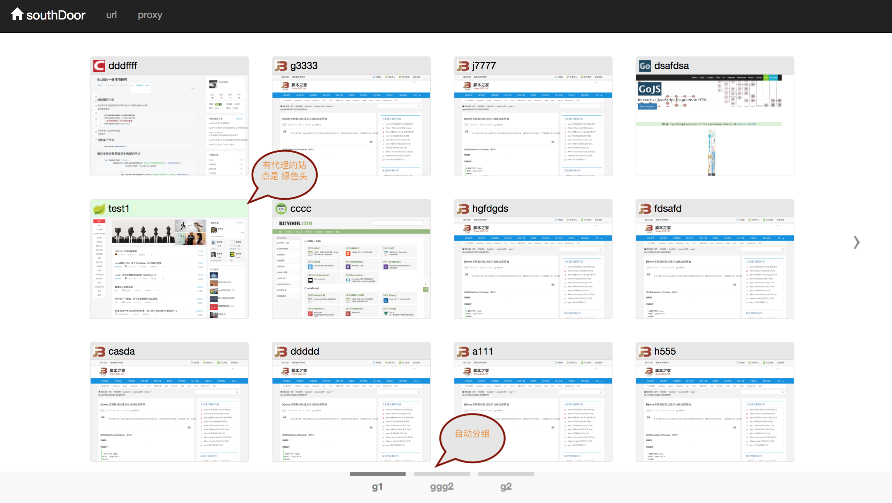
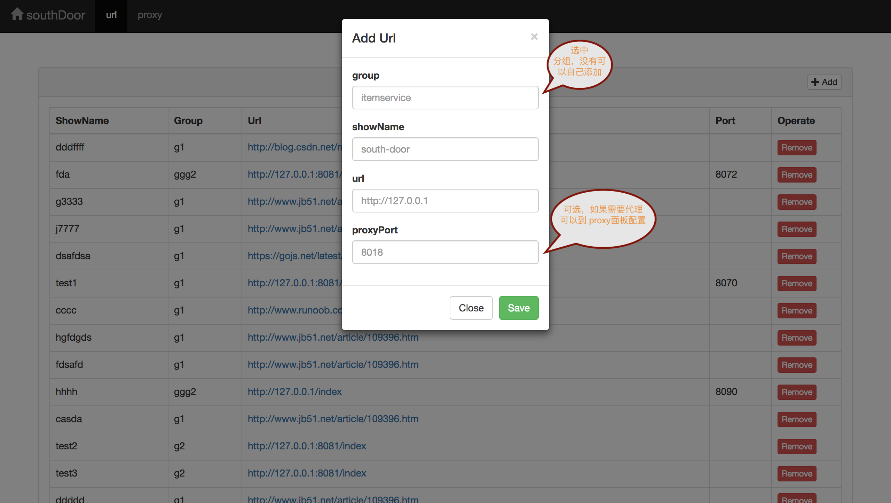

# south-door
> 南天门站点管理平台，支持 tcp 代理功能

## 一、特性

#### 1 支持网页收藏功能，自动生成网页缩略图
#### 2 支持 tcp 代理，假设服务部署到线上本地无法访问可以这个时候可以在跳板机使用 tcp 代理来访问

## 二、使用方式
> 南天门主要包含来两个模块到功能：网页收藏、tcp 代理

#### 1 首页截图

#### 2 网页收藏
> 收藏到网页会自动生成缩略图

 
#### 3 tcp 代理 
> 原理：在本地启动代理端口，然后通过socket client链接远程IP:port,将返回到数据写入到 代理端口

